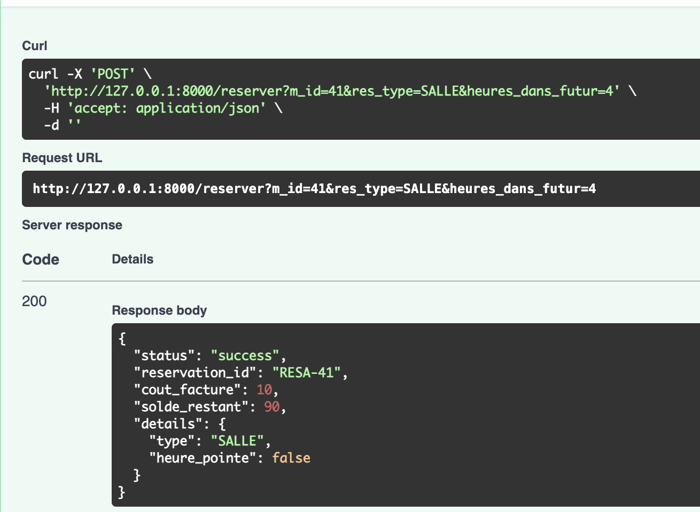
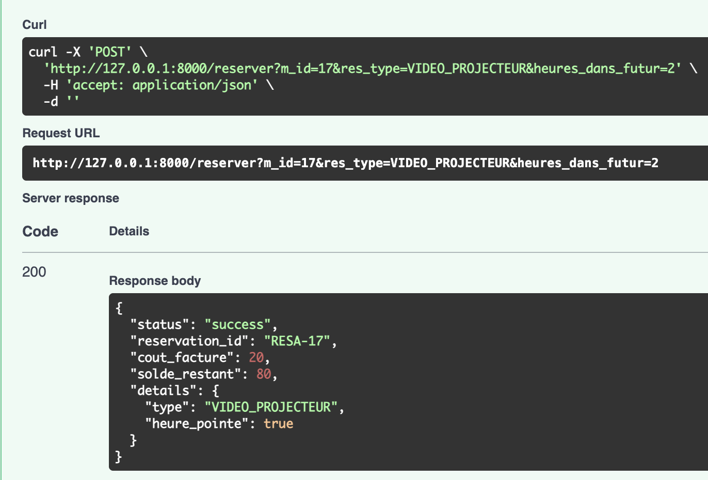
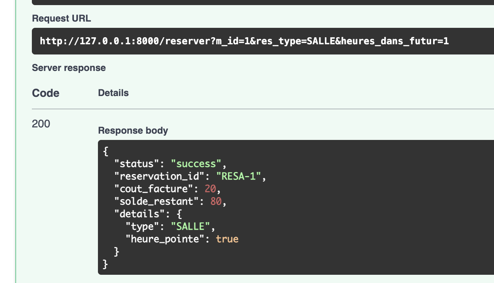
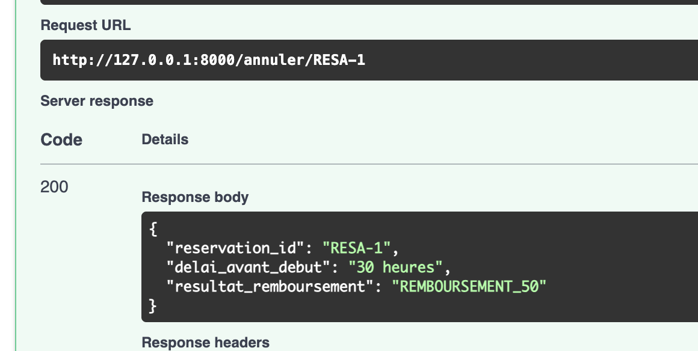
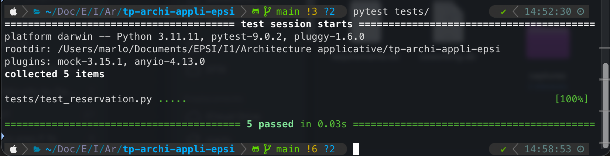

# Système de Réservation Co-working (TP Architecture Applicative)

**Auteur :** MEMAIN Maël

### Technologies utilisées
- **Framework :** FastAPI
- **Langage :** Python 3.11+
- **Base de données :** SQLite (via Pattern Repository)
- **Tests :** Pytest & Pytest-mock

---

## Architecture & Concepts mis en œuvre

### 1. Domain Driven Design (DDD)
Le projet est découpé en couches pour isoler la logique métier de l'infrastructure :
- **Entités :** 
    - `Membre`
    - `Ressource`
    - `Reservation`.
- **Value Objects :**
    - `CreneauHoraire` (gère la logique temporelle).
    - `Tarification` (encapsule la stratégie de prix).
- **Service de Domaine :** 
    - `ReservationService` pour gérer les règles de dépendances complexes.

### 2. Design Patterns
- **Repository Pattern :** L'accès aux données est abstrait dans `infra/repository.py`, rendant le stockage (SQLite/Fichiers) interchangeable. 
- **Strategy Pattern :** La logique de calcul du prix (Heures de pointe vs Heures creuses) est déléguée au Value Object `Tarification`.

### 2.5. Précision sur le Repository
- Le Repository est actuellement configuré pour SQLite mais peut être basculé sur un système de fichiers JSON en modifiant une ligne de code.

### 3. Règles Métier Complexes
- **Tarification Dynamique :** Le prix est doublé si la réservation commence entre 14h et 18h.
- **Dépendance de Ressources :** Impossible de réserver un vidéoprojecteur sans avoir une salle sur le même créneau.
- **Annulation Dégressive :** Remboursement calculé selon le délai (100% si >48h, 50% si >24h).

---

## Installation et Lancement

1. **Installation des dépendances :**
    - pip install -r requirements.txt

2. **Lancer l'api :**
    - uvicorn app.main:app --reload

3. **Lancer les tests :**
    - pytest tests/

4. **Accès au Swagger :** 
    - http://127.0.0.1:8000/docs

---

## Structure 
- **app/** : Contrôleurs API (Couche Application).

- **domain/** : Logique métier pure (Entités, VO, Services).

- **infra/** : Persistance des données (Repository).

- **tests/** : Tests unitaires (Mocks et Stubs).

- **Diagramme.pdf** : Diagramme de classe UML.

--- 

## Démonstration (Screenshots)

### Réservation réussie (Tarification Dynamique)

### Blocage métier (Vidéoprojecteur seul)

### Réservation puis annulation (Annulation dégressive)

### Tests Automatisés (Pytest)

